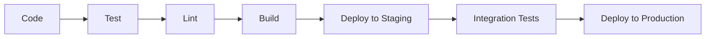

# NexusLang v2 - Architecture Overview

**System Design for 22nd Century AI Development Platform**

---

## High-Level Architecture

```
┌─────────────────────────────────────────────────────────────┐
│                        User Layer                           │
│  (Web Browser, Mobile App, CLI, API Clients)               │
└─────────────────────────────────────────────────────────────┘
                            │
                            ▼
┌─────────────────────────────────────────────────────────────┐
│                    Frontend Layer                           │
│  ┌──────────┐  ┌──────────┐  ┌──────────┐  ┌──────────┐  │
│  │   IDE    │  │Grokopedia│  │Community │  │  Voice   │  │
│  │  (Monaco)│  │ (Search) │  │  (Forum) │  │   UI     │  │
│  └──────────┘  └──────────┘  └──────────┘  └──────────┘  │
│              Next.js 14 + React 18 + TypeScript             │
└─────────────────────────────────────────────────────────────┘
                            │
                            ▼
┌─────────────────────────────────────────────────────────────┐
│                     API Gateway                             │
│              FastAPI + WebSocket + GraphQL                  │
│         (Authentication, Rate Limiting, Routing)            │
└─────────────────────────────────────────────────────────────┘
                            │
        ┌───────────────────┼───────────────────┐
        ▼                   ▼                   ▼
┌──────────────┐  ┌──────────────┐  ┌──────────────┐
│   IDE        │  │  Grokopedia  │  │    Voice     │
│  Service     │  │   Service    │  │   Service    │
└──────────────┘  └──────────────┘  └──────────────┘
        │                   │                   │
        ▼                   ▼                   ▼
┌──────────────┐  ┌──────────────┐  ┌──────────────┐
│  NexusLang   │  │   Billing    │  │   Social     │
│  Compiler    │  │   Service    │  │   Service    │
└──────────────┘  └──────────────┘  └──────────────┘
                            │
        ┌───────────────────┼───────────────────┐
        ▼                   ▼                   ▼
┌──────────────┐  ┌──────────────┐  ┌──────────────┐
│  PostgreSQL  │  │  Elasticsearch│  │    Redis     │
│   +pgvector  │  │  (Search)    │  │   (Cache)    │
└──────────────┘  └──────────────┘  └──────────────┘
```

---

## Core Components

### 1. NexusLang v2 Language Core

**Purpose:** AI-optimized programming language with native AI constructs

**Key Features:**
- Human-readable `.nx` source files
- Binary `.nxb` compiled format for AI processing
- Native tensor operations (no imports)
- Personality system for AI behavior
- Knowledge graph integration
- Voice synthesis built-in

**Technology:**
- Python 3.11+ for interpreter/compiler
- NumPy for tensor operations
- Custom lexer/parser/AST
- Binary protocol compiler

**File Location:** `v2/nexuslang/`

---

### 2. Web-Based IDE

**Purpose:** VSCode-quality development environment in the browser

**Key Features:**
- Monaco editor with syntax highlighting
- Real-time collaboration (CRDT)
- Integrated terminal and REPL
- File explorer with Git integration
- AI-powered code completion
- Visual debugging for ML models

**Technology:**
- Next.js 14 (React Server Components)
- Monaco Editor
- Y.js for real-time sync
- WebSocket for collaboration
- Zustand for state management

**File Location:** `v2/frontend/app/ide/`

---

### 3. Grokopedia Knowledge Base

**Purpose:** Universal knowledge repository for AI and humans

**Key Features:**
- Semantic search (embeddings)
- Knowledge graph (interconnected concepts)
- AI fact-checking and verification
- Community contributions
- Version control (wiki-style)
- Direct NexusLang integration

**Technology:**
- PostgreSQL with pgvector for embeddings
- Elasticsearch for full-text search
- FastAPI for REST API
- React for frontend

**File Location:** `v2/backend/services/grokopedia/`

---

### 4. Voice System

**Purpose:** Native voice-to-voice AI interaction

**Components:**

**Speech-to-Text (STT):**
- OpenAI Whisper
- Real-time streaming
- Multi-language support

**Text-to-Speech (TTS):**
- Coqui TTS (open-source)
- Custom voice models
- Emotion/tone control
- Low latency (<500ms)

**Voice Cloning:**
- Fine-tuning on user samples
- Custom voice generation

**Technology:**
- PyTorch for models
- WebRTC for real-time audio
- FastAPI for API
- WebSocket for streaming

**File Location:** `v2/backend/services/voice/`

---

### 5. Billing & Payment System

**Purpose:** Subscription management and usage tracking

**Features:**
- Shopify Payments integration
- Credit-based usage system
- Subscription tiers (Free/Pro/Enterprise)
- API key management
- Usage analytics
- Webhook handlers

**Technology:**
- Shopify Admin API
- Shopify Checkout API
- FastAPI for backend
- React for billing UI

**File Location:** `v2/backend/services/billing/`

---

### 6. Social & Community Platform

**Purpose:** Code sharing and collaboration

**Features:**
- Public/private projects
- Code sharing and forking
- Discussion forums (Q&A)
- Team workspaces
- Live coding sessions
- Reputation system

**Technology:**
- PostgreSQL for data
- Socket.IO for real-time
- FastAPI for API
- Next.js for UI

**File Location:** `v2/backend/services/social/`

---

## Data Architecture

### Database Schema (PostgreSQL)

```sql
-- Users and Authentication
users (id, email, username, password_hash, created_at)
api_keys (id, user_id, key_hash, permissions, created_at)
sessions (id, user_id, token, expires_at)

-- Billing and Credits
subscriptions (id, user_id, tier, status, shopify_subscription_id)
credits (id, user_id, balance, total_used, last_refill)
transactions (id, user_id, amount, type, description, created_at)

-- NexusLang Projects
projects (id, user_id, name, description, visibility, created_at)
files (id, project_id, path, content, version, updated_at)
collaborators (project_id, user_id, role, permissions)

-- Grokopedia
knowledge_entries (id, title, content, embeddings, verified, created_at)
knowledge_graph (source_id, target_id, relationship_type, weight)
contributions (id, entry_id, user_id, change_type, approved_at)

-- Social Features
posts (id, user_id, title, content, tags, upvotes, created_at)
comments (id, post_id, user_id, content, created_at)
teams (id, name, description, created_by, created_at)
team_members (team_id, user_id, role, joined_at)
```

### Caching Strategy (Redis)

```
# User sessions
session:{session_id} -> user data (TTL: 24h)

# API rate limiting
ratelimit:{api_key}:{endpoint} -> request count (TTL: 1h)

# Credit balances (hot data)
credits:{user_id} -> balance (TTL: 5min)

# Grokopedia search results
search:{query_hash} -> results (TTL: 1h)

# Compiled NexusLang code
compiled:{file_hash} -> binary code (TTL: 24h)
```

### Search Index (Elasticsearch)

```json
// Knowledge entries index
{
  "mappings": {
    "properties": {
      "title": {"type": "text"},
      "content": {"type": "text"},
      "summary": {"type": "text"},
      "tags": {"type": "keyword"},
      "verified": {"type": "boolean"},
      "created_at": {"type": "date"}
    }
  }
}

// Code projects index
{
  "mappings": {
    "properties": {
      "name": {"type": "text"},
      "description": {"type": "text"},
      "files_content": {"type": "text"},
      "language": {"type": "keyword"},
      "visibility": {"type": "keyword"}
    }
  }
}
```

---

## API Architecture

### REST API Endpoints

```
# Authentication
POST   /api/v2/auth/register
POST   /api/v2/auth/login
POST   /api/v2/auth/logout
GET    /api/v2/auth/me

# NexusLang Execution
POST   /api/v2/nexuslang/run
POST   /api/v2/nexuslang/compile
POST   /api/v2/nexuslang/analyze
GET    /api/v2/nexuslang/examples

# IDE Operations
GET    /api/v2/ide/projects
POST   /api/v2/ide/projects
GET    /api/v2/ide/projects/{id}
PUT    /api/v2/ide/projects/{id}
DELETE /api/v2/ide/projects/{id}
GET    /api/v2/ide/files/{project_id}
POST   /api/v2/ide/files/{project_id}

# Grokopedia
GET    /api/v2/grokopedia/search
GET    /api/v2/grokopedia/entries/{id}
POST   /api/v2/grokopedia/entries
PUT    /api/v2/grokopedia/entries/{id}
GET    /api/v2/grokopedia/graph/{concept}

# Voice
POST   /api/v2/voice/stt
POST   /api/v2/voice/tts
POST   /api/v2/voice/clone
WS     /api/v2/voice/stream

# Billing
GET    /api/v2/billing/subscriptions
POST   /api/v2/billing/subscribe
POST   /api/v2/billing/cancel
GET    /api/v2/billing/credits
POST   /api/v2/billing/buy-credits

# Social
GET    /api/v2/community/posts
POST   /api/v2/community/posts
GET    /api/v2/community/projects/public
POST   /api/v2/community/teams
```

### WebSocket Channels

```
# Real-time collaboration
/ws/ide/collaborate/{project_id}

# Voice streaming
/ws/voice/stream/{session_id}

# Live coding sessions
/ws/community/live/{session_id}

# Notifications
/ws/notifications/{user_id}
```

---

## Security Architecture

### Authentication & Authorization

- **JWT tokens** for stateless authentication
- **API keys** for programmatic access
- **OAuth2** for third-party integrations
- **Rate limiting** per user/API key
- **RBAC** (Role-Based Access Control)

### Data Protection

- **Encryption at rest** (AES-256)
- **Encryption in transit** (TLS 1.3)
- **Password hashing** (bcrypt)
- **API key hashing** (SHA-256)
- **CORS** properly configured
- **CSP headers** for XSS prevention

### Infrastructure Security

- **Firewall** (UFW on Linux)
- **Container isolation** (Docker)
- **Network policies** (Kubernetes)
- **Secrets management** (Environment variables + Vault)
- **Automated backups** (Daily to S3)
- **Intrusion detection** (fail2ban)

---

## Deployment Architecture

### Development Environment

```yaml
# docker-compose.yml
services:
  frontend:    # Next.js dev server
  backend:     # FastAPI with hot reload
  postgres:    # Database
  redis:       # Cache
  elasticsearch: # Search engine
```

### Production Environment

```
Load Balancer (Cloudflare)
    │
    ├─── Frontend (CDN + Edge Functions)
    │
    └─── Backend API (Auto-scaling)
            │
            ├─── Application Servers (Kubernetes pods)
            ├─── Database (PostgreSQL cluster)
            ├─── Cache (Redis cluster)
            ├─── Search (Elasticsearch cluster)
            └─── Storage (S3-compatible)
```

### Scaling Strategy

**Horizontal Scaling:**
- API servers: Auto-scale based on CPU/memory
- Workers: Queue-based job processing
- Database: Read replicas for queries

**Vertical Scaling:**
- Database: Increase resources for hot data
- Cache: More memory for frequently accessed data

**Geographic Distribution:**
- Multi-region deployment
- CDN for static assets
- Regional databases for low latency

---

## Monitoring & Observability

### Metrics (Prometheus)

- API response times
- Database query performance
- Cache hit rates
- Resource utilization
- Error rates

### Logging (ELK Stack)

- Application logs
- Access logs
- Error logs
- Audit logs

### Tracing (Jaeger)

- Distributed request tracing
- Service dependency mapping
- Performance bottleneck identification

### Alerting

- Slack/Discord notifications
- PagerDuty for critical issues
- Email for warnings

---

## Technology Decisions

### Why FastAPI?

- Native async/await support
- Automatic API documentation
- Type checking with Pydantic
- High performance (uvicorn)
- Easy WebSocket integration

### Why Next.js?

- Server-side rendering (SSR)
- Static site generation (SSG)
- API routes built-in
- Great developer experience
- React Server Components

### Why PostgreSQL?

- ACID compliance
- JSON support for flexible schemas
- pgvector for embeddings
- Mature ecosystem
- Excellent performance

### Why Shopify Payments?

- Lower transaction fees
- Built-in subscription management
- Multi-currency support
- Unified commerce platform
- Strong fraud protection

---

## Performance Targets

| Metric | Target | Monitoring |
|--------|--------|-----------|
| API Response Time | <100ms (p95) | Prometheus |
| Page Load Time | <1s | Lighthouse |
| IDE Startup | <2s | Custom metrics |
| Voice Latency | <500ms | WebRTC stats |
| Search Query | <200ms | Elasticsearch |
| Database Query | <50ms | PgHero |
| Uptime | 99.9% | UptimeRobot |

---

## Development Workflow



### CI/CD Pipeline

1. **Code Push** to GitHub
2. **GitHub Actions** runs tests
3. **Docker images** built
4. **Deploy to staging** automatically
5. **Run integration tests**
6. **Manual approval** for production
7. **Deploy to production** with rolling update
8. **Health checks** verify deployment
9. **Rollback** if health checks fail

---

## Cost Optimization

### Infrastructure Costs (Monthly)

- **VPS/Cloud:** $200-500 (based on traffic)
- **Database:** $100-200 (managed PostgreSQL)
- **CDN:** $0-50 (Cloudflare free + Pro)
- **Storage:** $20-50 (S3-compatible)
- **Monitoring:** $0-100 (Prometheus self-hosted)

**Total:** ~$320-900/month

### API Costs (Variable)

- **OpenAI:** Based on usage (~$50-500/month)
- **Voice Processing:** Compute costs (~$20-200/month)

---

## Future Enhancements

- **WebAssembly** for browser-side NexusLang execution
- **GPU acceleration** for ML models (CUDA/Metal)
- **Mobile apps** (React Native)
- **VS Code extension** for NexusLang
- **GraphQL API** for complex queries
- **Real-time analytics dashboard**

---

**Built with First Principles. Designed for Scale. Optimized for Performance.**

_Last Updated: November 11, 2025_

